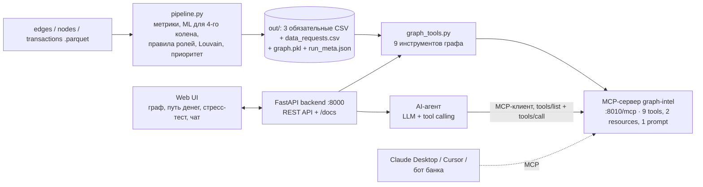

# 🕸 Граф денег — кого проверять первым и почему

**HackAlem AI · кейс «Граф денег»: восстановление финансовой структуры организованной группы по транзакционной сети.**

AML-аналитик знает 81 «курьера» (seed). Инструмент за ~30 секунд строит модель всей сети из 2 248 клиентов:
присваивает каждому роль по формальному правилу с числовым обоснованием, делит сеть на кластеры,
ранжирует узлы по приоритету проверки и показывает схему потоков. AI-аналитик отвечает на вопросы вроде
«кто собирает деньги с этих пятерых?», а MCP-сервер открывает те же инструменты любому AI-клиенту банка.

> Все выводы — **гипотезы для углублённой проверки** («признаки консолидации»), а не утверждение о виновности.
> Персональные данные не используются, только структура переводов и суммы.

## Требование ТЗ → где реализовано → как проверить

| Требование ТЗ | Где реализовано | Как проверить |
|---|---|---|
| Must-have 1. Воспроизводимый пайплайн, ≤ 5 минут | `pipeline.py`, `validate()` | `python pipeline.py` → три обязательные CSV и `самопроверка: OK` |
| Must-have 2. Роль, скор и evidence у каждого узла | `assign_roles()`, `out/nodes_roles.csv` | `pytest -q tests` → 2 248 уникальных gid, заполненные поля и скоры в [0,1] |
| Must-have 3. Формальные объяснимые критерии ролей | `THRESHOLDS`, раздел «Критерии ролей», `explain.py` | `python explain.py <gid1> <gid2> <gid3>` → роль, метрики и обоснование |
| Must-have 4. Кластеры и гипотезы | `clusters()`, `cluster_table()`, `out/clusters.csv` | Открыть CSV: размер, seed, оборот, ключевые узлы, гипотеза; проверить `cluster_id` тестами |
| Must-have 5. Топ ≥ 20 и визуализация | `priority()`, `out/top_nodes.csv`, `server.py`, `web/` | `python run.py` → топ-30, поиск gid, стрелки потоков, роли и кластеры |
| Опционально: учёт обрыва графа | `forward_probability()`, `sub_role`, модель 4-го колена | «Методика» → AUC и проверка на искусственной границе; карточка узла `depth=4` |
| Опционально: временные паттерны | `temporal_features()` | Карточка → быстрый транзит, плательщики за день и график переводов |
| Опционально: циклы возврата | `cycle_features()`, колонка `cycles` | Найти узел с `cycles>0`, открыть карточку или `explain.py` |
| Опционально: аномалии и дробление | `anomaly_features()`, дополнительные колонки `nodes_roles.csv` | `pytest -q tests/test_extras.py`; карточки узлов с `anomaly_flag` / `structuring_flag` |
| Опционально: устойчивость сети | `resilience()`, `simulate_removal()` | Вкладка «Стресс-тест» → блокировка топ-N и случайный бейзлайн |
| Опционально: AI-ассистент | `agent.py`, `mcp_server.py` | Вкладка «AI-аналитик» → вопрос об общих получателях; видны вызовы инструментов и gid |
| Опционально: карточка узла | `graph_tools.node_card()`, `explain.py` | `python explain.py` → справки по топ-3 без UI, ключей и аккаунтов |
| Опционально: оценка полноты | `data_requests()`, `out/data_requests.csv`, MCP `data_gaps` | «Методика» → топ-12 запросов; `/api/data_requests?n=12`; в карточке — рекомендации для gid |

---

## ⚡ Запуск

**Требования:** Python 3.11 или 3.12, ~300 МБ диска. Интернет не нужен (только для опционального LLM).

```bash
pip install -r requirements.txt
python run.py
```

`run.py` — **одна команда** для всего решения:
1. пайплайн `pipeline.py`: raw .parquet → 3 обязательные CSV + `data_requests.csv` + граф (~20–30 с, 8 автопроверок контрактов ТЗ);
2. **MCP-сервер** `graph-intel` (Streamable HTTP, `http://127.0.0.1:8010/mcp`), отдельный процесс;
3. **backend FastAPI + веб-интерфейс**: **http://localhost:8000** (браузер откроется сам), Swagger API: http://localhost:8000/docs.

Только выгрузки (как в ТЗ): `python pipeline.py --data data --out out`. Пересчитать всё: `python run.py --rebuild`.
Windows: `run.bat`, Linux/macOS: `bash run.sh`. Запасной интерфейс на Streamlit: `streamlit run app.py`.

**Результат** в `out/`:

| Файл | Содержимое |
|---|---|
| `nodes_roles.csv` | 2 248 строк: `gid, role, role_score, cluster_id, priority_score, evidence` + все метрики, на которых основана роль |
| `clusters.csv` | 66 кластеров: `cluster_id, n_nodes, n_seed, sum_kzt_internal, top_gids, hypothesis` |
| `top_nodes.csv` | топ-30: `rank, gid, role, priority_score, why` |
| `data_requests.csv` | `rank, gid, request, reason, priority_score`: какие данные запросить следующими; несколько строк на gid допустимы |
| `run_meta.json` | пороги, веса, коэффициенты модели, результаты стресс-теста; `extras` — количества аномалий, признаков дробления, запросов и затронутых узлов |
| `graph.pkl` | граф и метрики для UI / MCP (не коммитится) |

Выгрузки также лежат в репозитории (папка `out/`), их можно проверить без запуска.

### Переменные окружения (опционально, только для AI-аналитика)

| Переменная | Назначение | По умолчанию |
|---|---|---|
| `OPENAI_API_KEY` | ключ OpenAI-совместимого API | — (без ключа работает режим правил) |
| `OPENAI_BASE_URL` | другой провайдер, например `https://integrate.api.nvidia.com/v1` | OpenAI |
| `OPENAI_MODEL` | модель с поддержкой tool calling | `gpt-4o-mini` |
| `LLM_MODE=mock` | принудительно режим правил | — |

Пример: `.env.example`. **Весь основной сценарий проверяется без ключей и аккаунтов.**

---

## 🏗 Архитектура



**Как работает AI-агент:** получает список инструментов у MCP-сервера (`tools/list`), передаёт их LLM как функции,
LLM сама решает, что вызвать, вызовы идут через MCP (`tools/call`), ответ содержит gid и цифры, найденные узлы
подсвечиваются на графе. В интерфейсе видна каждая операция: `MCP · common_receivers · 37 мс`.
Без `OPENAI_API_KEY` агент работает в режиме правил **на тех же MCP-инструментах**; если MCP-сервер не поднят,
инструменты вызываются напрямую (помечается `direct`).

| Файл | Роль |
|---|---|
| `pipeline.py` | детерминированный пайплайн: метрики → роли → кластеры → приоритет → CSV + самопроверка |
| `graph_tools.py` | инструменты графа: node_info, node_card, neighbors, trace_money, common_receivers, top_nodes, cluster_info, simulate_removal, data_gaps |
| `mcp_server.py` | MCP-сервер graph-intel (FastMCP): те же инструменты по протоколу MCP (stdio / Streamable HTTP) |
| `agent.py` | AI-агент: MCP-клиент + LLM function calling; fallback на правилах |
| `server.py` | backend FastAPI: `/api/summary, /api/top, /api/search, /api/node/{gid}, /api/graph, /api/flow/{gid}, /api/clusters, /api/simulate, /api/ask, /api/health, /api/download` |
| `web/` | фронтенд (HTML/CSS/JS, vis-network лежит локально в `web/vendor`, без CDN) |
| `run.py` | запуск всего одной командой |
| `explain.py` | справка и пять крупнейших контрагентов по каждому gid из командной строки |
| `app.py` | запасной интерфейс на Streamlit |
| `starter/` | стартовый код организаторов (не изменялся) |

### Веб-интерфейс
- **Топ-сеть / Окружение / Кластер**: направленный граф, цвет = роль, ★ = seed, размер = приоритет, толщина = сумма.
- **▶ Путь денег**: анимация, как деньги seed-клиентов по коленам (слева направо) доходят до узла и куда уходят дальше, с суммами на рёбрах.
- **Карточка узла**: роль, уверенность, evidence, метрики, флаги, из чего сложился приоритет, контрагенты, переводы по датам.
- **🤖 AI-аналитик**: чат, шаги агента с вызовами MCP-инструментов, подсветка найденных узлов.
- **Стресс-тест**: «заблокировать топ-N», узлы гаснут на схеме, кривая «наш приоритет vs случайные узлы».
- **Методика**: правила ролей, формула приоритета, метрики модели 4-го колена. Выгрузки CSV скачиваются из шапки.

---

## 📐 Критерии ролей

Роли присваиваются **формальными правилами** (пороги — `THRESHOLDS` в `pipeline.py`). Если выполнено несколько
правил, выигрывает роль с большим скором уверенности `role_score ∈ [0,1]`. Все признаки интерпретируемы.

| Роль | Правило | Скор уверенности растёт от |
|---|---|---|
| **distributor** | ≥ 10 разных получателей | числа получателей |
| **consolidator** | ≥ 4 разных плательщиков (имеет приоритет над terminal) | числа плательщиков и доли удержанных средств (1 − pass_through) |
| **transit** | есть вход и выход, `pass_through = out/in ∈ [0.8; 1.2]`, не seed | доли суммы, ушедшей в течение ≤ 2 дней после поступления, и близости pass_through к 1 |
| **terminal** | исходящих нет И (≥ 2 плательщиков ИЛИ ≥ 100 тыс ₸). Для 4-го колена — только если `P(пересылает) < 0.35` | числа плательщиков и суммы |
| **coordinator** | не seed; деньги ≥ 3 seed доходят до узла за ≤ 2 перевода (`near_seeds`); ≥ 1 структурный посредник (consolidator/transit/distributor) на входе и ≥ 2 связей с посредниками всего; входящий оборот ≥ 75-го перцентиля | near_seeds, числа связей с посредниками и плательщиков |
| **peripheral** | ни одно правило не сработало: мелкие разовые получатели, слабые связи, неопределённые узлы 4-го колена | — |

**Итог на данных:** coordinator 11 · consolidator 60 · distributor 63 · transit 69 · terminal 431 · peripheral 1 614.

`evidence` у каждого узла содержит **числа**, например:
- `признаки консолидации: получает от 9 плательщиков (3 seed) 919 тыс ₸, дальше 8% полученного`
- `транзит: получил 268 тыс ₸, отдал 94%, 100% ушло в течение 2 дн. после прихода`
- `кандидат в организаторы: деньги 4 seed за ≤2 перевода, связан с 7 посредн. на входе…`

### Как объяснить роль любого gid за минуту
Откройте gid в UI (поиск слева) → вкладка «Карточка узла»: роль, скор, обоснование, крупнейшие плательщики и получатели,
транзакции по датам, флаги. В `nodes_roles.csv` рядом с ролью лежат все метрики правила: `in_deg, out_deg, in_kzt, out_kzt,
pass_through, near_seeds, fast_transit_share, p_forward, …`.

Без интерфейса и LLM:

```bash
python explain.py                         # пример на топ-3 по приоритету
python explain.py <gid> [<gid>...]         # один или несколько клиентов
```

Команда печатает `node_card`: роль, обоснование, потоки, флаги и рекомендуемые запросы данных.
Затем выводит пять крупнейших уникальных контрагентов по суммарному входящему и исходящему обороту,
с раздельными суммами направлений. Если gid неизвестен, сообщает об этом и возвращает ненулевой код выхода.

### Дополнительные сигналы: дробление и аномалии

`small_tx_share` — доля входящих транзакций с `5 000 ≤ sum_kzt < 10 000`.
`structuring_flag` срабатывает при `in_tx ≥ 5` и доле ≥ 0.7; пороги задают
`structuring_min_tx` и `structuring_share` в `THRESHOLDS`.

Для аномалий используются `log1p(in_kzt)`, `log1p(out_kzt)`, `in_deg`, `out_deg`,
`log1p(avg_tx_in)`, `fast_transit_share`, `max_payers_same_day`, `log1p(cycles)`.
Z-нормировка выполняется **внутри каждого depth**, по всем узлам колена; постоянные признаки получают 0.
`IsolationForest(n_estimators=300, random_state=42)` обучается на активных узлах (`in_deg + out_deg > 0`).
`anomaly_score` — перцентиль аномальности среди активных узлов (чем выше, тем необычнее профиль);
`anomaly_flag` отмечает верхние 3% с округлением количества вверх, при равных скорах — по gid.
Изолированные узлы получают скор 0 и не отмечаются. `anomaly_reason` описывает признак с наибольшим |z|;
это объяснение отклонения от своего колена, а не оценка вклада признака в IsolationForest или вероятность нарушения.

Пять новых колонок дополняют `nodes_roles.csv`. Флаги видны в карточках и дополняют `why` топ-листа.
Они не участвуют в присвоении ролей, кластеризации или расчёте приоритета.

### Оценка полноты и `data_requests.csv`

Пайплайн формирует по одной строке на рекомендуемый запрос, сортирует по убыванию существующего
`priority_score` и присваивает последовательный `rank`. Для одного gid возможны несколько запросов:

- `depth=4`, есть вход и (`P(пересылает) ≥ 0.35` или вход ≥ 500 тыс ₸): выписка исходящих за июль.
- Seed с выходом ≥ 500 тыс ₸: входящие поступления из-за пределов выборки.
- Признаки дробления: переводы ниже 5 000 ₸ и межбанковские за тот же период.
- Не-seed consolidator/coordinator на коленах 0–3 с `pass_through < 0.3` или неизвестным отношением:
  межбанковские переводы и снятие наличных.

Обоснования содержат наблюдаемые суммы, доли или P. Неизвестная доля не подменяется нулём.
Список доступен в «Методике» (топ-12, gid кликабельны), через `GET /api/data_requests?n=15`
(gid передаются строками), скачивание `/api/download/data_requests.csv` и MCP-инструмент `data_gaps(n=15)`.
`node_card` и `explain.py` показывают все рекомендации выбранного клиента. В режиме правил AI понимает
вопрос «Какие данные запросить?». Новые проверки: `pytest -q tests/test_extras.py`.

---

## 🪤 Как учтены ловушки данных

1. **Обрыв на 4-м колене.** Проверено на данных: ребро всегда записано на колене *(глубина плательщика + 1)*. Значит,
   исходящие узлов 0–3 колена **собраны полностью**, а у всех 444 узлов 4-го колена **не собраны вообще**.
   Наивное «out_deg = 0 ⇒ конечный получатель» здесь неверно. Решение:
   - на 1 723 узлах колен 1–3, где правда известна, обучена **логистическая регрессия** «переслал ли узел деньги дальше»
     только по **входящему** поведению (сумма, число плательщиков, число переводов, средний чек, активные дни);
   - она применяется к узлам 4-го колена: `P(пересылает) < 0.35` и заметная сумма → `terminal` (sub_role `likely_sink_truncated`),
     иначе `peripheral` с пометкой `truncated_unknown` / `truncated_small` и рекомендацией запросить выписку исходящих;
   - **качество проверено двумя способами:**
     случайная отложенная выборка 25% (стандартизация только по train) — ROC-AUC **0.71** (бейзлайн «число плательщиков» 0.66);
     **искусственная граница** (обучение на коленах 1–2, прогноз для колена 3 только по входящим признакам) —
     ROC-AUC **0.60** (бейзлайн 0.55). Модель лучше однофакторного правила, но перенос между коленами слабый,
     поэтому порог консервативный: в `terminal` попадают только узлы с `P < 0.35` и заметной суммой (79 из 444),
     остальные честно помечены как неопределённые (`peripheral`, sub_role `truncated_*`) с рекомендацией запросить выписку;
   - коэффициенты и метрики модели — в `run_meta.json` и во вкладке «Методика».
2. **Заниженные входящие у seed.** Для seed не строится transit (pass_through некорректен), consolidator-скор seed умножается
   на 0.8, в evidence явная пометка, приоритет seed ×0.6 (они уже известны, фокус на тех, кто выше).
3. **Суммы ≠ количество.** Используются обе величины: `in_kzt / in_tx`, средний чек, число разных контрагентов.
4. **Направленность.** Все метрики ролей считаются на **направленном взвешенном** графе. Неориентированная проекция
   используется **только** для Louvain-кластеризации (вес ребра = log(1 + сумма)); это оговорено.
5. **19 seed без рёбер** добавлены в граф как изолированные узлы и получили роль `peripheral` с обоснованием.

---

## 🧩 Кластеры

Louvain (networkx, `seed=42`, детерминирован) на неориентированной проекции. Гипотеза кластера строится по составу ролей:
«многоуровневая схема: N seed → консолидаторы/транзит → координатор X», «сбор средств от N seed в точке консолидации X»,
«веерная рассылка от X на N получателей» и т. д. 66 кластеров, из них 10 содержат больше одного seed.

## 🎯 Приоритет проверки

`priority = 0.30·(вес роли × role_score) + 0.25·near_seeds + 0.20·оборот + 0.15·PageRank + 0.10·betweenness`,
все компоненты нормированы в [0,1] (перцентили), seed ×0.6, итог нормирован на максимум.
Вес роли: coordinator 1.0, consolidator 0.9, distributor 0.75, transit 0.6, terminal 0.35, peripheral 0.05.
Компоненты приоритета выгружены в `nodes_roles.csv` (`prio_*`), поэтому любая позиция в топе прозрачна.

**Проверка, что приоритет работает (стресс-тест):**

| Блокировка | Падение достижимости seed → узел |
|---|---|
| топ-10 по нашему приоритету | **−31.6%** |
| 10 случайных узлов | −13.2% |
| топ-30 по нашему приоритету | **−71.7%** |
| 30 случайных узлов | −14.7% |

---

## 🧭 Порядок проверки основного сценария

1. `python pipeline.py --data data --out out`: в консоли 7 шагов, `nodes_roles=2248, clusters=66, top_nodes=30`
   и строка **самопроверки контрактов ТЗ** (8 проверок: каждый gid один раз, роли из словаря, поля заполнены,
   evidence ≤ 200 символов, скоры в [0,1], согласованность cluster_id, топ ≥ 20 и по убыванию). При ошибке — код выхода 1.
2. `python run.py` → откроется http://localhost:8000. В шапке индикатор **MCP · 9 tools** (зелёный = агент работает через MCP).
3. Слева топ-лист приоритетов; клик по узлу открывает **карточку** справа. Поиск по любому gid (можно часть номера).
4. **▶ Путь денег** на узле №1: анимация потоков от seed-клиентов к координатору.
5. Вкладка **Стресс-тест**: ползунок «заблокировать топ-N».
6. Вкладка **🤖 AI-аналитик**: пример «Кто собирает деньги с …» → шаги `MCP · common_receivers`, `MCP · trace_money`, ответ с gid,
   подсветка на графе. Без ключа работает режим правил на тех же MCP-инструментах.
7. http://localhost:8000/docs: Swagger всех эндпоинтов.

## 🔌 MCP-сервер отдельно (AI-интерфейс к графу расследования)

```bash
python mcp_server.py            # stdio
python mcp_server.py --http     # http://127.0.0.1:8010/mcp  (проверка: npx @modelcontextprotocol/inspector)
```

Tools: `node_info, node_card, neighbors, trace_money, common_receivers, top_nodes, cluster_info, simulate_removal, data_gaps`;
resources: `graph://methodology`, `graph://node/{gid}`; prompt: `investigate`.
Пример для Claude Desktop / Cursor:

```json
{"mcpServers": {"graph-intel": {"command": "python", "args": ["mcp_server.py"], "cwd": "<путь к репо>"}}}
```

---

## ⚠️ Ограничения подхода

- Только внутрибанковские исходящие переводы ≥ 5 000 ₸ за июль: дробление ниже порога и внешние потоки не видны.
- Баланс узла неполный (входящие извне выборки не видны), поэтому pass_through — индикатор, а не бухгалтерия.
- Ground truth нет: пороги выбраны по распределениям данных и смыслу ролей, их можно менять в `THRESHOLDS`.
- Модель для 4-го колена переносит поведение колен 1–3 на 4-е; проверка на искусственной границе показывает слабый перенос (AUC 0.60), поэтому такие узлы помечены отдельно и роль им присваивается консервативно.
- `near_seeds`, быстрый транзит и циклы — структурные признаки: они не доказывают прохождение тех же самых денег (суммы входа и выхода не сопоставляются по цепочке).

## 📈 Масштабирование до ~1 млн узлов

- Хранение: parquet → **DuckDB/Polars** для агрегатов; граф — **igraph / graph-tool / cuGraph** вместо networkx.
- Betweenness → **аппроксимация по выборке источников** (k-sampling); PageRank/HITS масштабируются линейно.
- Циклы: не перечисление, а поиск **SCC** + ограниченный поиск циклов только внутри SCC с seed.
- `near_seeds` / `seed_reach`: мультиисточниковый BFS по seed с отсечкой глубины (линейно по рёбрам).
- Кластеры: **Leiden** (igraph) вместо Louvain.
- UI: схема строится только для окружения / кластера (уже так), общая карта — предрасчитанная раскладка.
- Инкрементальный пересчёт по новым транзакциям, граф в **Neo4j / Memgraph**, MCP-инструменты работают поверх него без изменений.

---

## 🧰 Технологии и сторонние компоненты (п. 5.4.4)

Python 3.11 · pandas · pyarrow · networkx (PageRank, HITS, betweenness, Louvain, simple_cycles) · scikit-learn
(LogisticRegression) · FastAPI · uvicorn · vis-network 9.1.2 (лежит в `web/vendor`, Apache-2.0/MIT) · MCP Python SDK 1.30 (FastMCP + клиент) ·
openai SDK (опционально) · Streamlit + pyvis + plotly (запасной интерфейс).
Стартовый код организаторов — `starter/` (без изменений, используется как эталон схемы выгрузок).

**Заранее подготовленные компоненты (п. 5.4.4.2):** только окружение (Python, uv, MCP SDK) и общий опыт работы с MCP.
Весь код решения написан во время соревновательной части.
**AI-инструменты при разработке (п. 5.4.12):** использовались ассистенты для генерации и ревью кода.
