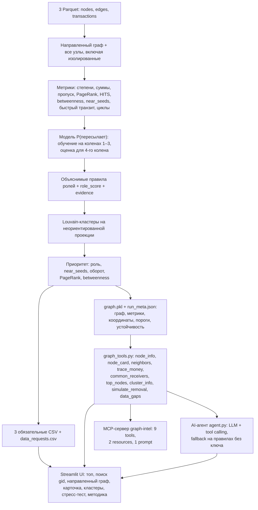

# Архитектура «Граф денег» — HackAlem AI

Документ сопоставляет ТЗ с локальным кодом на 23.09.2026. Корень репозитория — `money-graph/`; основной расчёт — [`pipeline.py`](../pipeline.py). Цель: дать аналитику объяснимый ответ «кого проверять первым и почему» по наблюдаемому графу переводов.

## Схема решения

Все блоки реализованы: пайплайн, экран аналитика, AI-агент и MCP-сервер работают поверх одного слоя запросов `graph_tools.py`.



CSV — контракт сдачи. Для отображения связей нужны также рёбра: текущий пайплайн сохраняет их в `graph.pkl`. Одних трёх CSV для восстановления графа недостаточно. UI и агент должны читать результаты одного запуска.

## Вход и границы наблюдения

| Файл | Поля | Объём по ТЗ |
|---|---|---|
| `nodes.parquet` | `gid, depth, is_seed` | 2 248 узлов, 81 seed |
| `edges.parquet` | `src, dst, sum_kzt, n_tx, depth` | 3 119 направленных рёбер |
| `transactions.parquet` | `src, dst, date, sum_kzt` | 4 840 переводов |

Период — июль 2026, только внутрибанковские переводы от 5 000 KZT. Внешние входящие, переводы ниже порога и движение за пределами периода неизвестны. Для 444 узлов `depth=4` исходящие не собраны. Нулевой наблюдаемый выход не доказывает удержание средств. У seed входящие особенно неполны; коэффициент пропуска не является балансом счёта.

`build_graph()` сначала добавляет все `gid` из nodes, затем рёбра. Это сохраняет 19 seed без связей. В конце пайплайна `validate()` проверяет контракты выгрузок (8 проверок) и завершает запуск с кодом 1 при нарушении.

## Метрики: фактическая реализация

| Группа | Расчёт и назначение |
|---|---|
| Степени | `in_deg`, `out_deg`: число разных контрагентов |
| Суммы и количество | `in_kzt`, `out_kzt`, `in_tx`, `out_tx`; средняя входящая транзакция |
| Пропуск | `pass_through = out_kzt / in_kzt`; при нулевом входе — NaN |
| PageRank | Взвешен по `sum_kzt`; участвует в приоритете |
| HITS | `hub`, `authority`; текущий вызов не передаёт денежный вес, это структурные показатели |
| Betweenness | Точный расчёт на направленном графе без весов; участвует в приоритете |
| Связь с seed | Прямые `seed_payers`, достижимость `seed_reach`, число разных seed на расстоянии 1–2 направленных переходов `near_seeds` |
| Быстрый транзит | Доля исходящей суммы, для которой есть хотя бы одно поступление за предшествующие 0–2 дня |
| Временные признаки | Число активных дат входа, первая/последняя дата, максимум разных плательщиков на дату |
| Циклы | Число обнаруженных простых направленных циклов длиной до 6 с участием узла; обход прерывается после превышения 20 000 циклов |

`near_seeds` показывает структурную достижимость, а не доказанное прохождение конкретных денег. Быстрый транзит не сопоставляет суммы входа и выхода: маленькое поступление может пометить большой исходящий перевод. Циклы также не проверяют хронологию транзакций. В объяснениях это признаки возможного паттерна, а не подтверждённый возврат тех же денег.

## Дополнительные сигналы и запросы данных

`anomaly_features()` вызывается после временных признаков и циклов, до `forward_probability()`.
Доля входящих транзакций в диапазоне `[5 000; 10 000)` сохраняется как `small_tx_share`;
`structuring_flag` требует не менее 5 входящих переводов и доли не менее 0.7.

IsolationForest (300 деревьев, seed=42) работает на активных узлах после z-нормировки внутри depth.
Признаки: логарифмы входящего/исходящего оборота, среднего входящего чека и числа циклов;
входящая/исходящая степени, быстрый транзит, максимум плательщиков за день. `anomaly_score` —
перцентиль аномальности, `anomaly_flag` — верхние 3% активных узлов. `anomaly_reason` описывает
наибольшее абсолютное z-отклонение; оно не является оценкой вклада признака в модель.
Роли, скоры ролей, evidence, кластеры и приоритет не используют эти дополнительные признаки.

`data_requests()` после ранжирования создаёт `data_requests.csv`: исходящие четвёртого колена,
внешние входящие seed, переводы ниже порога и межбанковские при признаках дробления,
межбанковские и наличные у консолидаторов/координаторов с низким пропуском.
Для одного узла допустимо несколько запросов, порядок — по убыванию приоритета.
MCP `data_gaps`, REST `/api/data_requests` (gid строкой) и блок «Методика» дают список,
`node_card` и `python explain.py [gid ...]` — рекомендации по выбранному клиенту.
Счётчики сохраняются в `run_meta.json.extras`; контракты проверяются в `tests/test_extras.py`.

## Модель для четвёртого колена

`forward_probability()` обучает `LogisticRegression` на не-seed узлах колен 1–3 с ненулевым входом. Целевая переменная — наличие наблюдаемого исходящего ребра (`out_deg > 0`).

Признаки: `log1p(in_kzt)`, `in_deg`, `log1p(in_tx)`, `log1p(avg_tx_in)`, `active_days_in`, `last_in_day`. Стандартизация использует среднее и стандартное отклонение обучающей выборки. Для наблюдаемых колен результат заменяется фактом 0/1; для четвёртого остаётся оценкой модели.

Это оценка сходства с узлами, пересылающими в пределах доступной выгрузки. Это не вероятность преступной роли и не подтверждение будущего перевода. Разметки ролей в ТЗ нет. `role_score` задаётся эвристиками и также не является калиброванной вероятностью.

Проверка качества (в `run_meta.json`): случайная отложенная выборка 25% (стандартизация только по train) — ROC-AUC 0.71 против 0.66 у бейзлайна «число плательщиков»; искусственная граница (обучение на коленах 1–2, прогноз колена 3, 789 узлов, доля пересылающих 0.36) — ROC-AUC 0.60 против 0.55. Перенос между коленами слабый, поэтому порог консервативный: terminal только при `P < 0.35` и заметной сумме, остальные узлы 4-го колена помечены как неопределённые. Параметры стандартизации и intercept сохранены в `run_meta.json`, модель воспроизводима.

## Правила ролей

Пороги заданы в `THRESHOLDS`. В первом проходе выбирается максимальный скор среди сработавших базовых правил. Во втором проходе возможна замена на `coordinator`.

| Роль | Условие в текущем коде |
|---|---|
| `distributor` | Не менее 10 разных получателей |
| `consolidator` | Не менее 4 разных плательщиков; скор учитывает их число и оценку удержания |
| `transit` | Не seed, есть вход и выход, пропуск в диапазоне `[0.8, 1.2]`; быстрые исходящие повышают скор |
| `terminal` | Есть вход, нет наблюдаемого выхода, вход ≥100 000 KZT или ≥2 плательщиков; при `depth=4` дополнительно `p_forward < 0.35` |
| `coordinator` | Не seed; ≥3 близких seed, ≥2 связей с базовыми consolidator/transit/distributor, включая ≥1 входящую; входящая сумма ≥75-го перцентиля среди узлов с входом и выходом |
| `peripheral` | Ни одно правило не победило; сюда также попадают неопределённые узлы границы |

Замена на coordinator происходит, если его скор ≥ текущего минус 0.05, либо базовая роль — terminal/peripheral/transit. `evidence` обрезается до 200 символов; `sub_role` отражает дополнительные состояния, но не всегда совпадает с итоговой ролью после второго прохода.

**Исправлено:** в ветке consolidator удержание `1 − pass_through` используется только для не-seed узлов с выгруженными исходящими; для 4-го колена и seed — оценка `1 − p_forward`. Формулировки evidence приведены к виду «исходящих в выборке не наблюдается». Гипотезы ролей не являются выводами о виновности.

## Кластеры и приоритет

Louvain работает на неориентированной проекции: вес каждого направления — `log1p(sum_kzt)`, встречные направления суммируются. `resolution=1.0`, `seed=42`. Кластеры нумеруются после сортировки по размеру и минимальному gid. Направленный исходный граф сохраняется для анализа потоков. Кластер не равен установленной организованной группе.

Приоритет до нормировки:

```text
0.30 × вес_роли × role_score
+ 0.25 × min(near_seeds / 6, 1)
+ 0.20 × percentile_rank(log1p(in_kzt + out_kzt))
+ 0.15 × percentile_rank(pagerank)
+ 0.10 × percentile_rank(betweenness)
```

Веса ролей: coordinator 1.0, consolidator 0.9, distributor 0.75, transit 0.6, terminal 0.35, peripheral 0.05. Для seed сумма умножается на 0.6; затем все значения делятся на максимум и округляются до четырёх знаков. Это относительный приоритет проверки в данном запуске. Учитывается входящий плюс исходящий оборот.

Идентификатор кластера не входит в формулу приоритета. `cluster_table()` после ранжирования считает внутренний оборот, число seed, топ-5 gid и шаблонную гипотезу. `resilience()` удаляет топ-5/10/20 не-seed узлов и пересчитывает связность, сумму оставшихся рёбер и достижимость от seed. Это структурный сценарий, не прогноз предотвращённого ущерба.

## Контракты результатов

| Артефакт | Обязательные поля / содержимое |
|---|---|
| `nodes_roles.csv` | `gid, role, role_score, cluster_id, priority_score, evidence`; одна строка на каждый входной узел |
| `clusters.csv` | `cluster_id, n_nodes, n_seed, sum_kzt_internal, top_gids, hypothesis` |
| `top_nodes.csv` | `rank, gid, role, priority_score, why`; по ТЗ не менее 20 строк |
| `data_requests.csv` | `rank, gid, request, reason, priority_score`; по одной строке на рекомендацию |
| `graph.pkl` | `G, df, tx, pos, clusters`: локальный кэш для UI/MCP |
| `run_meta.json` | Пороги, веса ролей, коэффициенты модели, устойчивость и длительность |

Дополнительные колонки разрешены README стартового кода. top_nodes содержит до 30 непериферийных узлов; если их меньше 20, список дополняется по приоритету — контракт «≥ 20» гарантирован. Pickle следует читать только из собственного локального запуска. Сохранённые коэффициенты без параметров стандартизации не составляют полный сериализованный объект модели.

## Streamlit, агент и MCP

**UI (`app.py`)**: топ-лист с обоснованием и картой всей сети; поиск gid; направленная схема окружения / кластера / топ-40 (цвет — роль, ★ — seed, толщина — сумма); карточка узла с контрагентами, транзакциями по датам и путями денег; таблица кластеров с гипотезами; стресс-тест «заблокировать топ-N» со сравнением со случайной блокировкой; вкладка «Методика» с порогами и метриками модели. gid передаются в JavaScript строками (18-значные числа теряют точность).

**MCP-сервер (`mcp_server.py`, FastMCP, mcp<2)**: 9 tools `node_info, node_card, neighbors, trace_money, common_receivers, top_nodes, cluster_info, simulate_removal, data_gaps`; resources `graph://methodology`, `graph://node/{gid}`; prompt `investigate`. Транспорт stdio или Streamable HTTP (`--http`, порт 8010).

**AI-агент (`agent.py`)**: вопрос → OpenAI-совместимая LLM сама вызывает те же инструменты (до 6 шагов) → ответ с gid и цифрами, найденные узлы подсвечиваются на схеме. Без `OPENAI_API_KEY` или при ошибке API — детерминированный режим правил на тех же инструментах. Агент не придумывает связи и атрибуты клиентов и не меняет рассчитанные роли.

## Проверка и запуск

Из корня workspace текущим окружением:

```powershell
.\.venv\Scripts\python.exe -X utf8 money-graph/pipeline.py --data money-graph/data --out money-graph/out
```

Из корня репозитория при установленных зависимостях:

```bash
python -X utf8 pipeline.py --data data --out out
```

`requirements.txt` репозитория фиксирует точные проверенные версии (Python 3.11). `.streamlit/config.toml` отключает интерактивный запрос e-mail при первом запуске.

Проверка существующих CSV: 2 248 уникальных gid, 66 кластеров, 30 строк топа; обязательные поля узлов заполнены, оба скора в `[0,1]`, рейтинг убывает, максимальная длина evidence — 114 символов. Среди 444 узлов четвёртого колена: 365 peripheral и 79 terminal. Это проверка формата и результатов эвристик, не подтверждение правильности ролей. В сохранённом `run_meta.json` указан запуск за 19.7 секунды.

Независимый прогон в `.review-output/` создал все артефакты за 23.3 секунды и прошёл перечисленные проверки CSV, но завершился с `UnicodeEncodeError`: финальная стрелка в `print` не кодируется в Windows cp1251. **Исправлено:** пайплайн сам переключает stdout/stderr в UTF-8 с заменой непечатаемых символов, из вывода убраны спецсимволы; запуск с `PYTHONIOENCODING=cp1251` завершается с кодом 0. Флаг `-X utf8` больше не обязателен.

Перед сдачей проверять: все входные gid представлены ровно один раз; роли принадлежат словарю; cluster_id согласованы между файлами; топ содержит ≥20 уникальных gid; evidence непустой и ≤200 символов; полный прогон занимает ≤300 секунд и возвращает код 0; UI находит произвольный gid, включая изолированный и пограничный узел.

## Статус требований ТЗ

| Must have | Статус |
|---|---|
| 1. Воспроизводимый пайплайн одной командой, < 5 мин | ✅ `python pipeline.py`, ~20–30 с, самопроверка контрактов |
| 2. Роль, скор и evidence у всех 2 248 узлов | ✅ |
| 3. Задокументированные объяснимые критерии ролей | ✅ README, вкладка «Методика», метрики в `nodes_roles.csv` |
| 4. Кластеризация с гипотезами | ✅ 66 кластеров, `clusters.csv` |
| 5. Топ-лист ≥ 20 + визуализация с направлением потоков и поиском gid | ✅ `top_nodes.csv` (30), Streamlit |

Опциональные пункты: учёт обрыва графа (модель + проверка на границе), временные паттерны (быстрый транзит, синхронные поступления), циклы возврата, аномалии и дробление, устойчивость сети (стресс-тест), AI-ассистент аналитика, автогенерация карточки узла, оценка полноты (`data_requests.csv`, четыре типа рекомендаций).

## Масштабирование до миллиона узлов

Точный betweenness, полный обход циклов, достижимость от каждого seed и общий spring-layout станут узкими местами. План: агрегировать Parquet пакетно; использовать компактное разреженное представление и производительный графовый движок; оценивать betweenness по выборке; ограничивать циклы и маршруты локальными подграфами; считать раскладку только видимой части сети. Признаки и ответы инструментов кэшировать по версии данных; UI отдавать ограниченный подграф. Это план развития, а не реализованная поддержка миллиона узлов.
