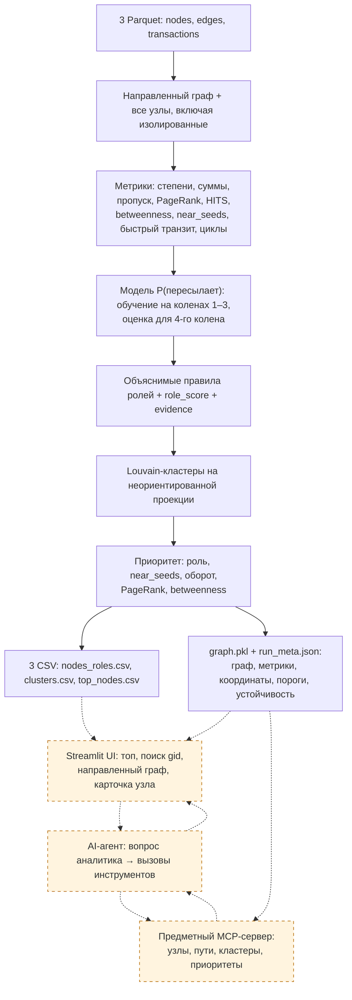

# Архитектура «Граф денег» — HackAlem AI

Документ сопоставляет ТЗ с локальным кодом на 23.09.2026. Корень репозитория — `money-graph/`; основной расчёт — [`pipeline.py`](../pipeline.py). Цель: дать аналитику объяснимый ответ «кого проверять первым и почему» по наблюдаемому графу переводов.

## Схема решения

Сплошные связи показывают реализованный расчёт. Пунктирные связи и оранжевые блоки — планируемый интерфейс и интеграция; наличие зависимостей не означает наличие этих компонентов.



CSV — контракт сдачи. Для отображения связей нужны также рёбра: текущий пайплайн сохраняет их в `graph.pkl`. Одних трёх CSV для восстановления графа недостаточно. UI и агент должны читать результаты одного запуска.

## Вход и границы наблюдения

| Файл | Поля | Объём по ТЗ |
|---|---|---|
| `nodes.parquet` | `gid, depth, is_seed` | 2 248 узлов, 81 seed |
| `edges.parquet` | `src, dst, sum_kzt, n_tx, depth` | 3 119 направленных рёбер |
| `transactions.parquet` | `src, dst, date, sum_kzt` | 4 840 переводов |

Период — июль 2026, только внутрибанковские переводы от 5 000 KZT. Внешние входящие, переводы ниже порога и движение за пределами периода неизвестны. Для 444 узлов `depth=4` исходящие не собраны. Нулевой наблюдаемый выход не доказывает удержание средств. У seed входящие особенно неполны; коэффициент пропуска не является балансом счёта.

`build_graph()` сначала добавляет все `gid` из nodes, затем рёбра. Это сохраняет 19 seed без связей. Входная валидация схем, уникальности пар рёбер и согласованности edges с transactions пока отсутствует.

## Метрики: фактическая реализация

| Группа | Расчёт и назначение |
|---|---|
| Степени | `in_deg`, `out_deg`: число разных контрагентов |
| Суммы и количество | `in_kzt`, `out_kzt`, `in_tx`, `out_tx`; средняя входящая транзакция |
| Пропуск | `pass_through = out_kzt / in_kzt`; при нулевом входе — NaN |
| PageRank | Взвешен по `sum_kzt`; участвует в приоритете |
| HITS | `hub`, `authority`; текущий вызов не передаёт денежный вес, это структурные показатели |
| Betweenness | Точный расчёт на направленном графе без весов; участвует в приоритете |
| Связь с seed | Прямые `seed_payers`, достижимость `seed_reach`, число разных seed на расстоянии 1–2 направленных переходов `near_seeds` |
| Быстрый транзит | Доля исходящей суммы, для которой есть хотя бы одно поступление за предшествующие 0–2 дня |
| Временные признаки | Число активных дат входа, первая/последняя дата, максимум разных плательщиков на дату |
| Циклы | Число обнаруженных простых направленных циклов длиной до 6 с участием узла; обход прерывается после превышения 20 000 циклов |

`near_seeds` показывает структурную достижимость, а не доказанное прохождение конкретных денег. Быстрый транзит не сопоставляет суммы входа и выхода: маленькое поступление может пометить большой исходящий перевод. Циклы также не проверяют хронологию транзакций. В объяснениях это признаки возможного паттерна, а не подтверждённый возврат тех же денег.

## Модель для четвёртого колена

`forward_probability()` обучает `LogisticRegression` на не-seed узлах колен 1–3 с ненулевым входом. Целевая переменная — наличие наблюдаемого исходящего ребра (`out_deg > 0`).

Признаки: `log1p(in_kzt)`, `in_deg`, `log1p(in_tx)`, `log1p(avg_tx_in)`, `active_days_in`, `last_in_day`. Стандартизация использует среднее и стандартное отклонение обучающей выборки. Для наблюдаемых колен результат заменяется фактом 0/1; для четвёртого остаётся оценкой модели.

Это оценка сходства с узлами, пересылающими в пределах доступной выгрузки. Это не вероятность преступной роли и не подтверждение будущего перевода. Разметки ролей в ТЗ нет. `role_score` задаётся эвристиками и также не является калиброванной вероятностью.

До сильной защиты нужно проверить модель на искусственной границе: обучить на коленах 1–2, оценить колено 3 по входящим признакам и сравнить с его наблюдаемыми исходящими. Показать baseline, размер классов, качество ранжирования и калибровку, затем переобучить на 1–3. Такая проверка всё равно не доказывает переносимость на колено 4. Сейчас в коде нет отложенной проверки и обработки пустой/одноклассовой обучающей выборки.

## Правила ролей

Пороги заданы в `THRESHOLDS`. В первом проходе выбирается максимальный скор среди сработавших базовых правил. Во втором проходе возможна замена на `coordinator`.

| Роль | Условие в текущем коде |
|---|---|
| `distributor` | Не менее 10 разных получателей |
| `consolidator` | Не менее 4 разных плательщиков; скор учитывает их число и оценку удержания |
| `transit` | Не seed, есть вход и выход, пропуск в диапазоне `[0.8, 1.2]`; быстрые исходящие повышают скор |
| `terminal` | Есть вход, нет наблюдаемого выхода, вход ≥100 000 KZT или ≥2 плательщиков; при `depth=4` дополнительно `p_forward < 0.35` |
| `coordinator` | Не seed; ≥3 близких seed, ≥2 связей с базовыми consolidator/transit/distributor, включая ≥1 входящую; входящая сумма ≥75-го перцентиля среди узлов с входом и выходом |
| `peripheral` | Ни одно правило не победило; сюда также попадают неопределённые узлы границы |

Замена на coordinator происходит, если его скор ≥ текущего минус 0.05, либо базовая роль — terminal/peripheral/transit. `evidence` обрезается до 200 символов; `sub_role` отражает дополнительные состояния, но не всегда совпадает с итоговой ролью после второго прохода.

**Ошибка для исправления:** в ветке consolidator переменная `kept` использует `pass_through`, если он не NaN. При `depth=4` и положительном входе этот коэффициент равен нулю, поэтому `kept=1`, хотя исходящие неизвестны. Следует сначала проверять `out_observed`, а оценку `1-p_forward` явно отделить от наблюдаемого удержания. Для seed балансоподобный признак тоже требует отдельной обработки. На текущей сохранённой выгрузке consolidator на четвёртом колене нет, но ошибка остаётся в правиле.

Фразы «деньги осели» и «дальше не ушло» нужно заменить на «исходящих переводов в доступной выборке не наблюдается». Гипотезы ролей не являются выводами о виновности.

## Кластеры и приоритет

Louvain работает на неориентированной проекции: вес каждого направления — `log1p(sum_kzt)`, встречные направления суммируются. `resolution=1.0`, `seed=42`. Кластеры нумеруются после сортировки по размеру и минимальному gid. Направленный исходный граф сохраняется для анализа потоков. Кластер не равен установленной организованной группе.

Приоритет до нормировки:

```text
0.30 × вес_роли × role_score
+ 0.25 × min(near_seeds / 6, 1)
+ 0.20 × percentile_rank(log1p(in_kzt + out_kzt))
+ 0.15 × percentile_rank(pagerank)
+ 0.10 × percentile_rank(betweenness)
```

Веса ролей: coordinator 1.0, consolidator 0.9, distributor 0.75, transit 0.6, terminal 0.35, peripheral 0.05. Для seed сумма умножается на 0.6; затем все значения делятся на максимум и округляются до четырёх знаков. Это относительный приоритет проверки в данном запуске. В коде учитывается входящий **плюс исходящий** оборот, хотя docstring функции говорит только о входящем.

Идентификатор кластера не входит в формулу приоритета. `cluster_table()` после ранжирования считает внутренний оборот, число seed, топ-5 gid и шаблонную гипотезу. `resilience()` удаляет топ-5/10/20 не-seed узлов и пересчитывает связность, сумму оставшихся рёбер и достижимость от seed. Это структурный сценарий, не прогноз предотвращённого ущерба.

## Контракты результатов

| Артефакт | Обязательные поля / содержимое |
|---|---|
| `nodes_roles.csv` | `gid, role, role_score, cluster_id, priority_score, evidence`; одна строка на каждый входной узел |
| `clusters.csv` | `cluster_id, n_nodes, n_seed, sum_kzt_internal, top_gids, hypothesis` |
| `top_nodes.csv` | `rank, gid, role, priority_score, why`; по ТЗ не менее 20 строк |
| `graph.pkl` | `G, df, tx, pos, clusters`: локальный кэш для UI/MCP |
| `run_meta.json` | Пороги, веса ролей, коэффициенты модели, устойчивость и длительность |

Дополнительные колонки разрешены README стартового кода. Сейчас top_nodes содержит до 30 непериферийных узлов; минимальные 20 строк код не гарантирует на другом наборе данных. Pickle следует читать только из собственного локального запуска. Сохранённые коэффициенты без параметров стандартизации не составляют полный сериализованный объект модели.

## Streamlit, агент и MCP: следующий этап

В проверенной локальной копии `ui/`, `agents/`, `flows/` на уровне workspace пусты. `mcp_servers/ping_server.py` содержит только `ping`; `smoke_test.py` проверяет получение списков MCP-инструментов, а не корректность аналитики. Эти файлы находятся вне репозитория `money-graph/`.

План интерфейса: топ приоритетов → поиск любого gid → карточка с ролью, числами и ограничениями → направленный подграф соседей → фильтр кластера → скачивание трёх CSV. Узлы четвёртого колена должны иметь заметную пометку «исходящие неизвестны». Карточка должна показывать компоненты приоритета и сработавшие правила.

Предлагаемые предметные MCP-инструменты, пока не реализованные:

| Инструмент | Результат |
|---|---|
| `get_node(gid)` | Роль, метрики, evidence, ограничения наблюдения |
| `get_neighbors(gid, direction, limit)` | Направления, суммы и число переводов на рёбрах |
| `get_paths(src, dst, max_hops)` | Ограниченные по длине наблюдаемые маршруты |
| `get_cluster(cluster_id)` | Состав, оборот, seed и гипотеза |
| `get_top_nodes(limit)` | Рейтинг с компонентами приоритета |

План агента: разобрать вопрос → вызвать инструменты → сформулировать гипотезу с gid и числовыми основаниями → предложить следующий запрос данных. Агент не должен придумывать связи, клиентские атрибуты или заменять рассчитанные роли. При недоступности LLM основной расчёт и UI продолжают работать локально; пояснения берутся из детерминированных шаблонов.

## Проверка и запуск

Из корня workspace текущим окружением:

```powershell
.\.venv\Scripts\python.exe -X utf8 money-graph/pipeline.py --data money-graph/data --out money-graph/out
```

Из корня репозитория при установленных зависимостях:

```bash
python -X utf8 pipeline.py --data data --out out
```

Для чистой машины нужно подготовить requirements репозитория: pandas, numpy, pyarrow, networkx, scipy и scikit-learn с проверенными совместимыми версиями. В корневом workspace requirements отсутствуют networkx и scikit-learn, хотя они установлены в текущем venv; starter requirements не устанавливает scikit-learn. README репозитория пока содержит только название команды.

Проверка существующих CSV: 2 248 уникальных gid, 66 кластеров, 30 строк топа; обязательные поля узлов заполнены, оба скора в `[0,1]`, рейтинг убывает, максимальная длина evidence — 114 символов. Среди 444 узлов четвёртого колена: 365 peripheral и 79 terminal. Это проверка формата и результатов эвристик, не подтверждение правильности ролей. В сохранённом `run_meta.json` указан запуск за 19.7 секунды.

Независимый прогон в `.review-output/` создал все артефакты за 23.3 секунды и прошёл перечисленные проверки CSV, но завершился с `UnicodeEncodeError`: финальная стрелка в `print` не кодируется в Windows cp1251. Повторный прогон с `-X utf8` завершился успешно с кодом 0 за 26.8 секунды: 2 248 узлов, 66 кластеров, 30 строк топа. Поэтому в командах выше явно включён UTF-8. Для пользовательского запуска также следует убрать зависимость успешного завершения от кодировки терминала.

Перед сдачей проверять: все входные gid представлены ровно один раз; роли принадлежат словарю; cluster_id согласованы между файлами; топ содержит ≥20 уникальных gid; evidence непустой и ≤200 символов; полный прогон занимает ≤300 секунд и возвращает код 0; UI находит произвольный gid, включая изолированный и пограничный узел.

## Приоритет доработок по ТЗ

1. **Закрыть обязательный экран:** направленные связи, поиск gid, роли, кластеры, числовая карточка. Сейчас этого нет в локальном коде.
2. **Обеспечить воспроизводимость:** полноценный README, зависимости внутри репозитория, запуск на чистом окружении, проверки контрактов CSV. Документация и воспроизводимость дают 25 из 100 баллов по приложенному ТЗ.
3. **Укрепить корректность:** исправить трактовку границы в consolidator, проверить модель на искусственной границе, уточнить тексты про транзит и удержание.
4. **Добавить предметного агента:** хотя бы один законченный сценарий «почему этот gid в топе?» с вызовом MCP и переходом к узлу. Сначала завершить обязательные функции.
5. **Подготовить пяти­минутное демо:** живой прогон; узел консолидации с контрагентами; транзит с датами; узел четвёртого колена с объяснением неопределённости; ответ агента и экспорт. Конкретные gid выбирать из рассчитанного результата, не зашивать в правила.

## Масштабирование до миллиона узлов

Точный betweenness, полный обход циклов, достижимость от каждого seed и общий spring-layout станут узкими местами. План: агрегировать Parquet пакетно; использовать компактное разреженное представление и производительный графовый движок; оценивать betweenness по выборке; ограничивать циклы и маршруты локальными подграфами; считать раскладку только видимой части сети. Признаки и ответы инструментов кэшировать по версии данных; UI отдавать ограниченный подграф. Это план развития, а не реализованная поддержка миллиона узлов.
